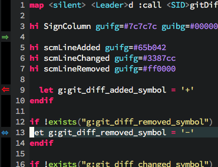

# Vim git inline diff

Adds signs on the left hand of your open buffer which mark the changed lines.

## Example

Example screen with the customized configuration below.




## Configuration

```vim
" Symbol for lines which have been added, default: +
let g:git_diff_added_symbol='⇒'

" Symbol for lines which have been removed, default: -
let g:git_diff_removed_symbol='⇐'

" Symbol for lines which have been changed, default: <>
let g:git_diff_changed_symbol='⇔'
```
